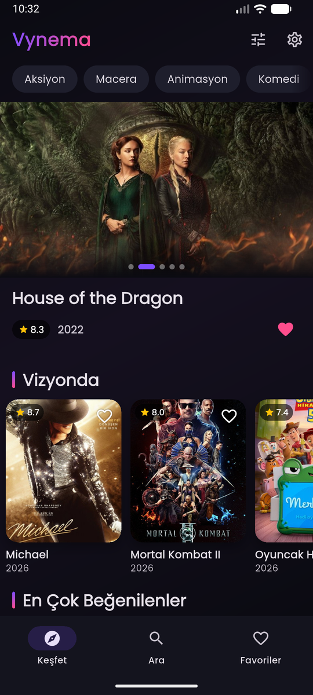
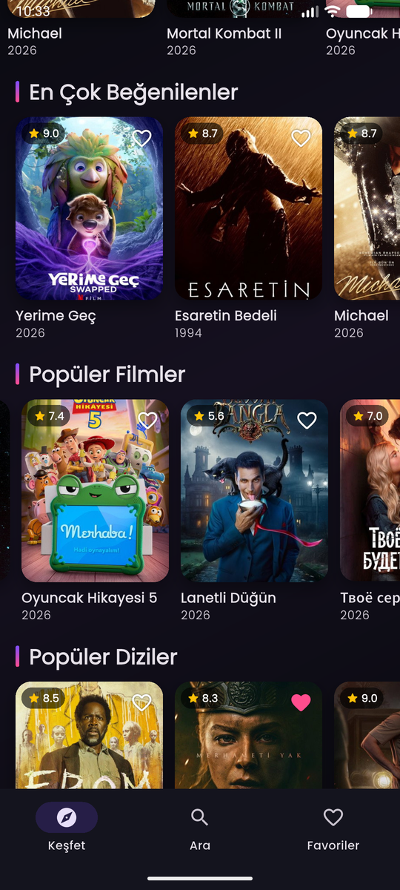
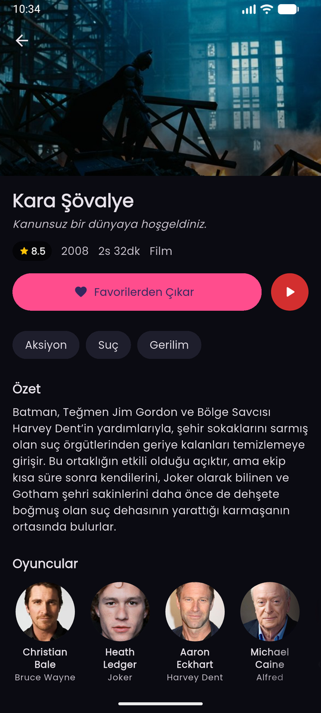
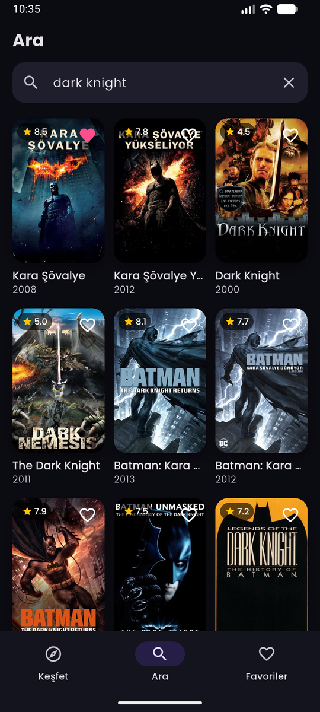
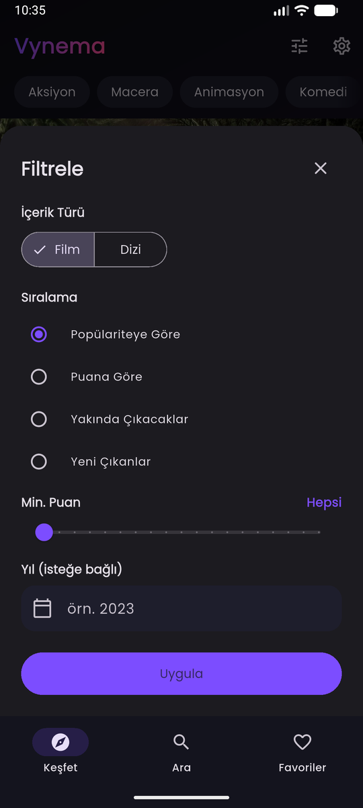
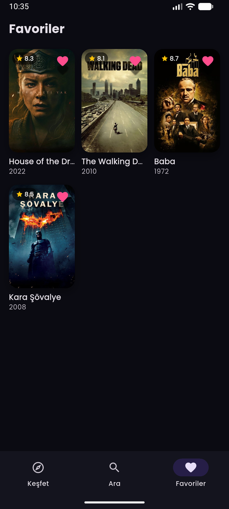
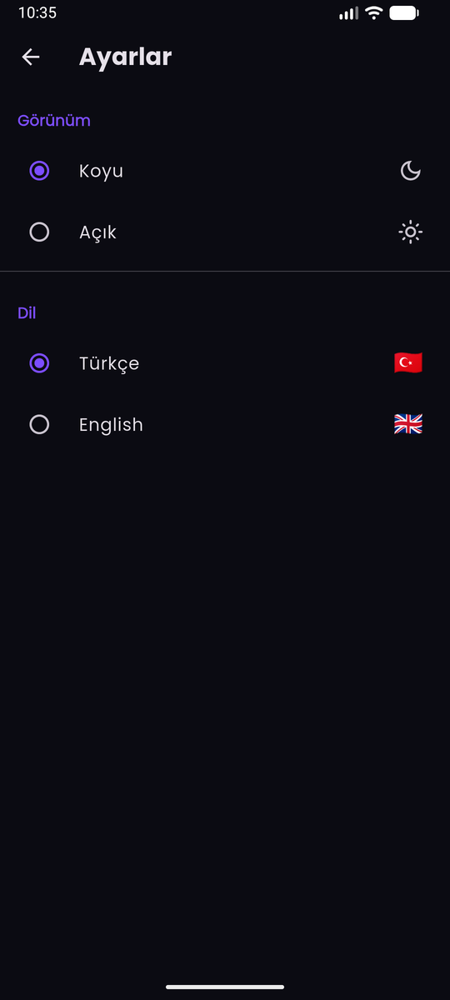
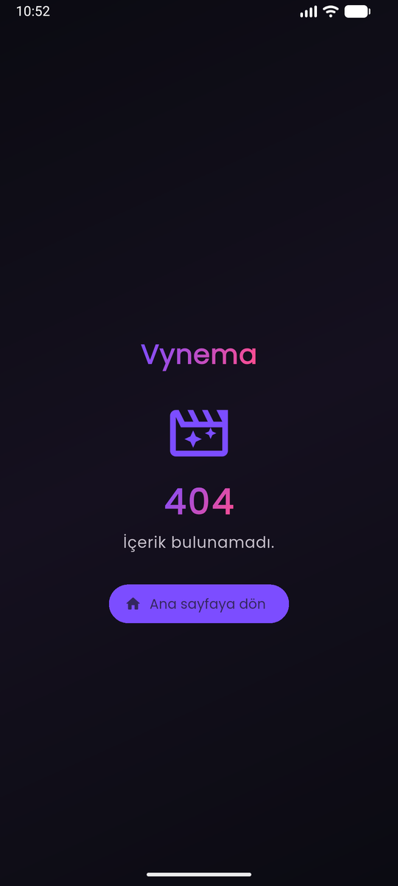

# Vynema

Flutter ile geliştirilmiş, [TMDB](https://www.themoviedb.org/) API ile çalışan modern bir film ve dizi keşif uygulaması. Trend ve popüler içerikleri keşfedin, film/dizi ve kişi araması yapın, zengin detay sayfalarını inceleyin ve kendi favori listenizi oluşturun — hepsi premium, koyu temalı bir arayüzde.

## Özellikler

- **Keşfet** — film ve diziler için trend, popüler, vizyondaki, yakında, yayında ve en çok oy alan listeleri
- **Arama** — film, dizi ve kişiler arasında çoklu arama
- **Detay sayfaları** — özet, puan, oyuncular, türler ve izleme platformları
- **Türe göre keşif** — herhangi bir türe özel, filtrelenebilir listelere inin
- **Kişiler** — profil ve öne çıkan yapımlarıyla kişi sayfaları
- **Favoriler** — içerik ekleyip çıkarın, cihazda yerel olarak saklanır
- **Ayarlar** — tema (koyu/açık) ve dil (Türkçe/İngilizce) çalışma anında değiştirilebilir, ikisi de kalıcı
- **İncelikli arayüz** — açılış ekranı, glassmorphism, gradient'ler, shimmer yükleme durumları ve akıcı geçişler

## Ekran Görüntüleri

<table>
  <tr>
    <td align="center"><br>Ana Sayfa</td>
    <td align="center"><br>Ana Sayfa Devamı</td>
    <td align="center"><br>Film/Dizi Detay</td>
    <td align="center"><br>Arama</td>
  </tr>
  <tr>
    <td align="center"><br>Filtreleme</td>
    <td align="center"><br>Favoriler</td>
    <td align="center"><br>Ayarlar</td>
    <td align="center"><br>404</td>
  </tr>
</table>

## Teknoloji Yığını

| Katman | Seçim |
|---|---|
| State yönetimi | Riverpod 3.x (`Notifier` / `NotifierProvider`, auto-dispose) |
| Yerel depolama | Hive (favoriler ve tercihler JSON map olarak, codegen yok) |
| Ağ | Dio + interceptor (`api_key` ve dile duyarlı `language` enjekte eder) |
| Navigasyon | go_router + `StatefulShellRoute` (durumu korunan alt menü sekmeleri) |
| Yerelleştirme | Flutter `gen-l10n` — Türkçe & İngilizce ARB dosyaları, çalışma anında değiştirilebilir |
| Yapılandırma / gizli anahtarlar | flutter_dotenv (`.env`, asla commit'lenmez) |
| Görseller | cached_network_image + shimmer placeholder'lar |
| Tipografi | google_fonts |

## Başlangıç

### Gereksinimler

- Flutter SDK 3.12+ (Dart 3.x)
- Ücretsiz bir [TMDB API key](https://www.themoviedb.org/settings/api)

### Kurulum

1. Repoyu klonlayın:
   ```bash
   git clone https://github.com/yasirkas/Vynema.git
   cd Vynema
   ```

2. `.env.example` dosyasından `.env` oluşturun ve API key'inizi girin:
   ```bash
   cp .env.example .env
   ```
   Ardından `.env` dosyasını açıp şu satırı doldurun:
   ```
   TMDB_API_KEY=key_buraya
   ```

3. Bağımlılıkları yükleyin:
   ```bash
   flutter pub get
   ```

4. Uygulamayı çalıştırın:
   ```bash
   flutter run
   ```

## Proje Yapısı

Domain'e göre düzenlenmiş, feature-first mimari:

```
lib/
├── core/
│   ├── config/          # Ortam / .env erişimi
│   ├── constants/       # TMDB endpoint'leri & görsel boyutları
│   ├── network/         # Dio client + interceptor + hata eşleme
│   ├── router/          # go_router yapılandırması
│   └── theme/           # Renkler ve Material temalar
├── features/
│   ├── discover/        # Ana sayfa, arama, detay, tür, kişi
│   ├── favorites/       # Favori listesi & repository
│   ├── settings/        # Tema & dil tercihleri
│   └── splash/          # Açılış ekranı
├── shared/
│   └── widgets/         # Yeniden kullanılabilir UI bileşenleri
└── l10n/                # Yerelleştirme (ARB + üretilen)
```

## API

[TMDB API v3](https://developer.themoviedb.org/reference/intro/getting-started) üzerine kuruludur. Tüm içerik, kullanıcının seçtiği dilde (`tr-TR` veya `en-US`) çekilir; bu, her isteğe Dio interceptor tarafından uygulanır.

> Bu ürün TMDB API'sini kullanır, ancak TMDB tarafından onaylanmış veya sertifikalandırılmış değildir.

## Proje Hakkında

Vynema, **[yasirkas](https://github.com/yasirkas)** tarafından geliştirilen kişisel bir portföy projesidir. Yalnızca eğitim ve demo amaçlıdır; ticari bir amaç taşımaz.

## Lisans

Bu bir **portföy projesidir** ve herkesin kullanımına açıktır. [PolyForm Noncommercial 1.0.0](LICENSE) © 2026 yasirkas — kişisel kullanım, öğrenme, deneme ve geliştirme için serbestçe klonlayın, çalıştırın ve değiştirin. **Ticari kullanım izin verilmez.** Telif bildirimi korunmalıdır.
